<h1 align="center"> EyeGo AI Task </h1>

### Creating Eyego app

To create a simple NodeJS web app with an API returning `Hello Eyego`, we can follow this blog [How to create a REST API with Node.js and Express](https://blog.postman.com/how-to-create-a-rest-api-with-node-js-and-express)

```bash
npm init
```
  
- create a js app

  
```bash
touch app.js
```

- Install Dependencies

  
```bash
npm install express
```  
check the API response with postman `https://localhost:3000/eyego`

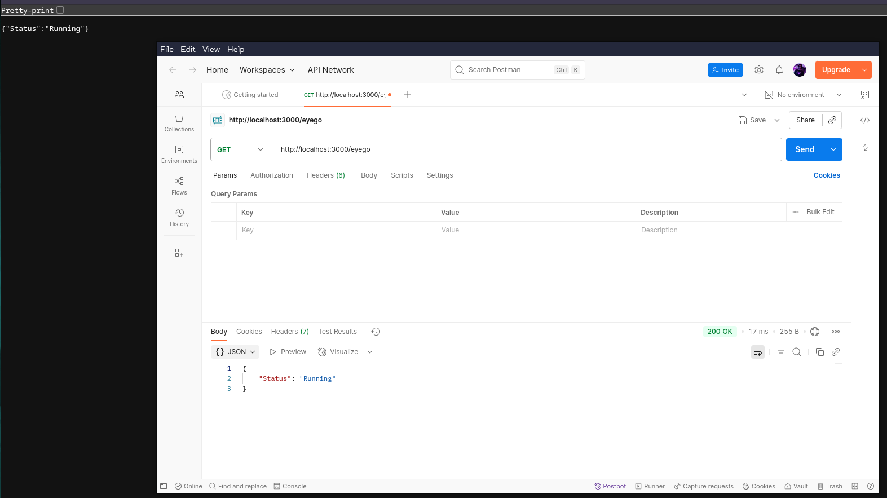

- let's print `Hello Eyego`
  - replace `response.send(status);` with `response.send('Hello Eyego');`
  - Terminate the server (<kbd>ctrl + c</kbd>) and run it again (`node app.js`)
  - 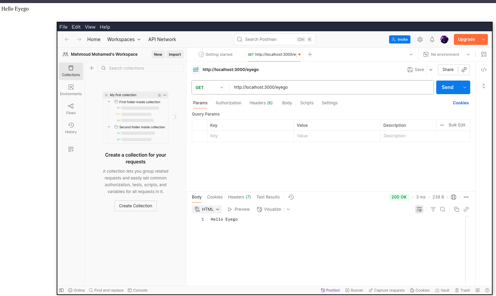


---

### Let's containerize the app

I'm gonna use the [official node image](https://hub.docker.com/_/node) from Docker Hub, I'll use the `alpine` image, as it's a very lightweight image

We can pull it with `docker pull node:lts-alpine`, but the Docker engine will download it from the Dockerfile

- build the image with tage
  - ```bash
    docker build -t eyego-app .
    ```
  - we can pull it to Docker Hub, but we need to change the tag based on the docker hub user and repo
    - build a new image `docker build -t  mmsaeed509/eyego-app:v1 .`
    - push to docker hub `docker push mmsaeed509/eyego-app:tagname`
    - here's the [image](https://hub.docker.com/repository/docker/mmsaeed509/eyego-app/general)
    - we can remove from the local system `docker image rm mmsaeed509/eyego-app:v1`

- Let's run the container and test the image 
  
```bash
docker run -p 3000:3000 eyego-app

# Naming Container
 docker run -p 3000:3000 --name EyegoJsApp eyego-app
# detach mode
docker run -p 3000:3000 -d eyego-app

# remove container Automatically when it stopped `--rm`
docker run -p 3000:3000 --rm --name EyegoJsApp eyego-app
```

I'll use `docker run -p 3000:3000 --rm --name EyegoJsApp eyego-app`

or you can run with docker-compose

```bash
docker-compose up

# or with detached mode
docker-compose up -d

# or
docker compose run eyego-app
```

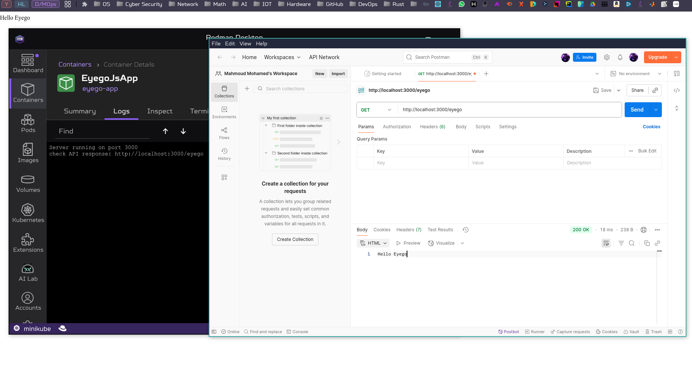

---

### push the image to Amazon Elastic Container Registry (ECR)

- Install AWS CLI
- create an IAM, login to console and create IAM user
  - I'll use the `aws-cli` user, that I was created before
  - 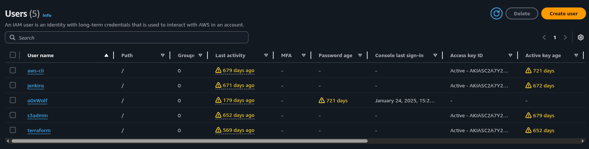
- Login to AWS CLI
  - `aws configure`
  - you can see the config files in `~/.aws`
  - 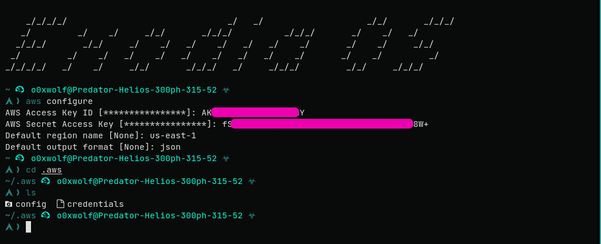
  - to know your region
  - 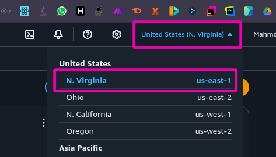
- create a new ECR repository
  - `aws ecr create-repository --repository-name eyego-app`
  - 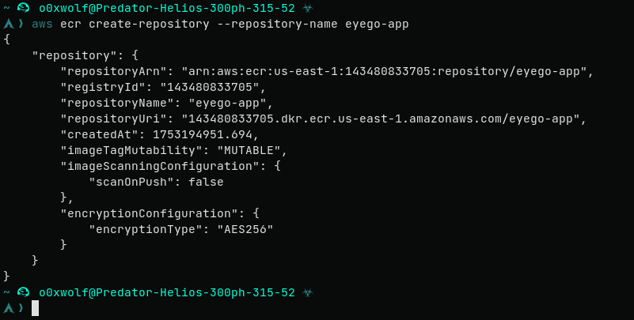
  - check the repository from Elastic Container Registry
  - 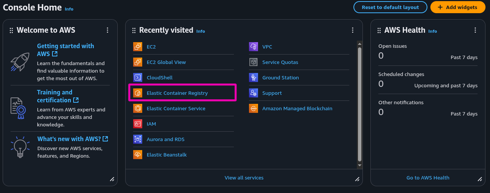
  - 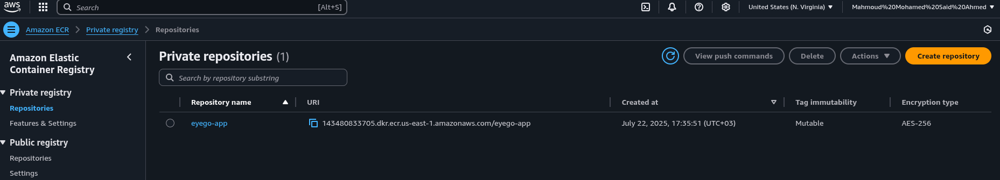
  - 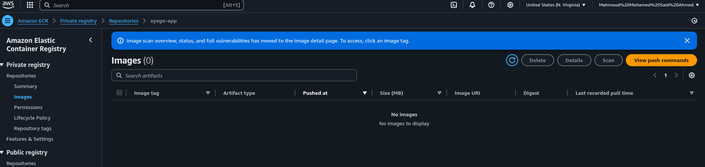
- Let's push the image to the ECR repository
- from ECR console, select your repository from the list and press on `View push commands`
  - 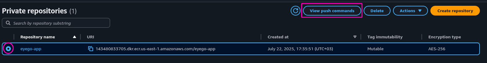
  - 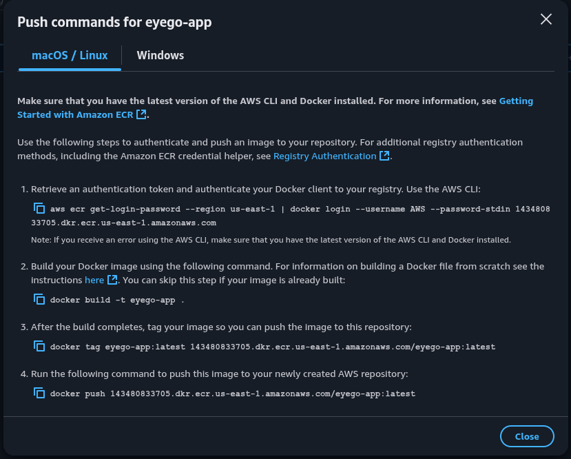
  - 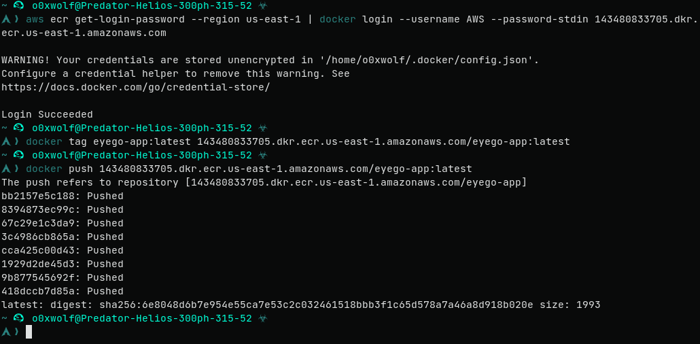
  - 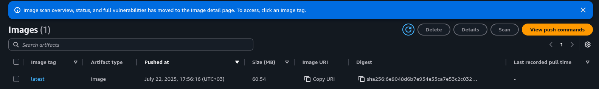
  - 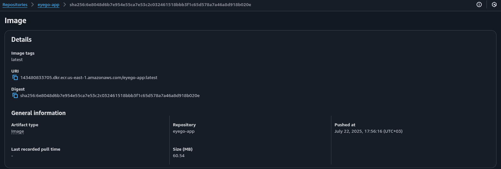


---

### Deploy the app on AWS EKS & Expose via LoadBalancer/Ingress

Let's test our cluster localy using `minikube`
> YAML k8s files that are used locally can also it used for EKS
> So, you can configure it once and use it for both

- install minikube and run the cluster and open the k8s dashboard

```bash
# Install the cluster on a Docker container
minikube start --driver=docker

# open the k8s dashboard
minikube dashboard
```

- let's deploy the app

```bash
cd k8s
kubectl apply -f .
# or
kubectl apply -f deployment.yaml -f service.yaml
```
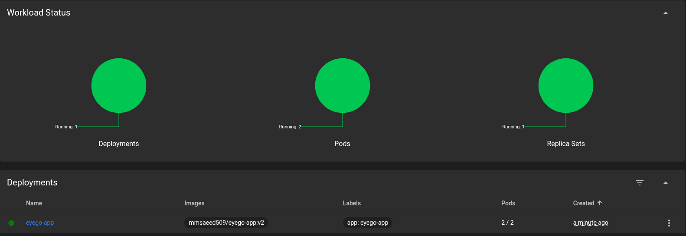


- Expose loadbalancer

```bash
minikube service eyego-service
# or to get only the access url
minikube service eyego-service --url
```
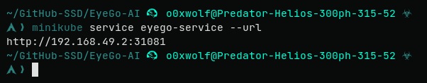

- check `http://192.168.49.2:31081/eyego`

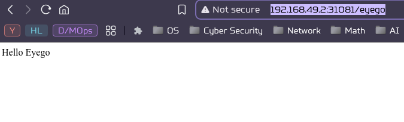

- check using postman

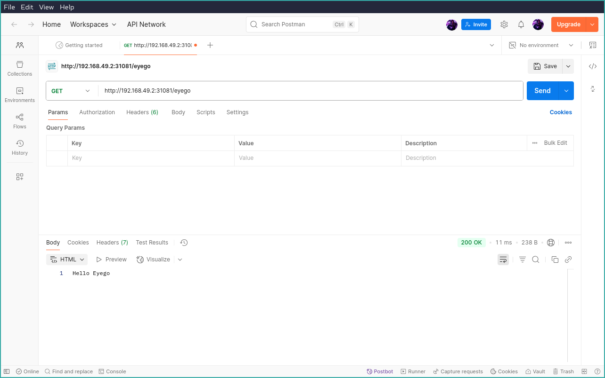


We used the image from Docker Hub now, let's use ECR, we'll follow the official documentation of minikube: [Configure credentials for AWS Elastic Container Registry using registry-creds addon](https://minikube.sigs.k8s.io/docs/tutorials/configuring_creds_for_aws_ecr)

If you got this error `minikube addons configure registry-creds`

```bash
panic: runtime error: invalid memory address or nil pointer dereference
[signal SIGSEGV: segmentation violation code=0x1 addr=0x8 pc=0x5653d408df15]

goroutine 1 [running]:
k8s.io/minikube/cmd/minikube/cmd/config.processRegistryCredsConfig({0x5653d41afe2c, 0x8}, 0x0)
	k8s.io/minikube/cmd/minikube/cmd/config/configure_registry_creds.go:93 +0x35
k8s.io/minikube/cmd/minikube/cmd/config.init.func8(0xc00053cf00?, {0xc000888660, 0x1, 0x5653d41a80ad?})
	k8s.io/minikube/cmd/minikube/cmd/config/configure.go:69 +0x21e
github.com/spf13/cobra.(*Command).execute(0x5653d768f360, {0xc000888630, 0x1, 0x1})
	github.com/spf13/cobra@v1.9.1/command.go:1019 +0xa7b
github.com/spf13/cobra.(*Command).ExecuteC(0x5653d768aea0)
	github.com/spf13/cobra@v1.9.1/command.go:1148 +0x40c
github.com/spf13/cobra.(*Command).Execute(...)
	github.com/spf13/cobra@v1.9.1/command.go:1071
k8s.io/minikube/cmd/minikube/cmd.Execute()
	k8s.io/minikube/cmd/minikube/cmd/root.go:174 +0x591
main.main()
	k8s.io/minikube/cmd/minikube/main.go:95 +0x235
```
 Try downgrading minikube. I downgraded to `minikube-1.26.0-1-x86_64`

- Delete the old cluster `minikube delete`
- Reboot
- Create a new cluster `minikube start --driver=docker`
- `minikube addons configure registry-creds`
  - 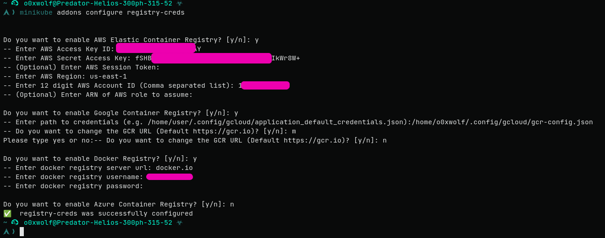
- enable `minikube addons enable registry-creds`
- upadte the `deployment.yaml`
  - replace `image: mmsaeed509/eyego-app:v2` with `image: 143480833705.dkr.ecr.us-east-1.amazonaws.com/eyego-app`
- deploy
  - 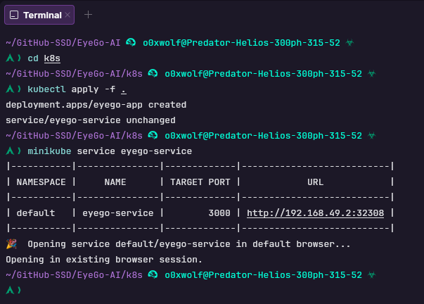
  - 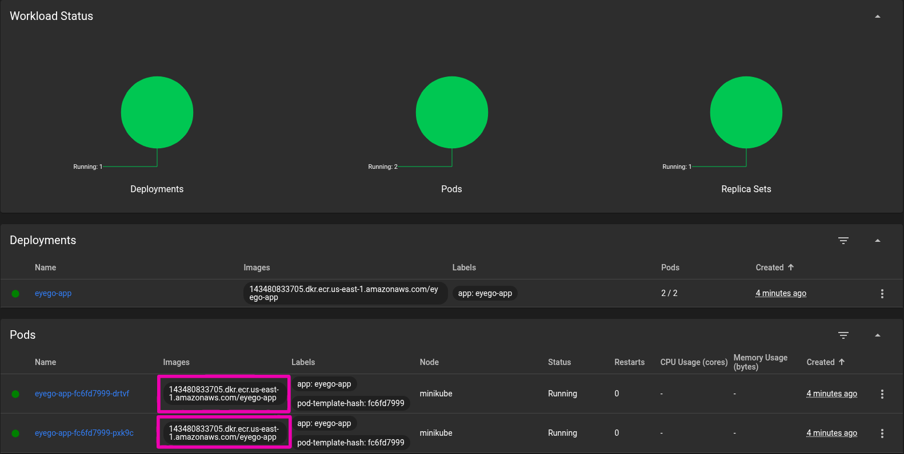
  - 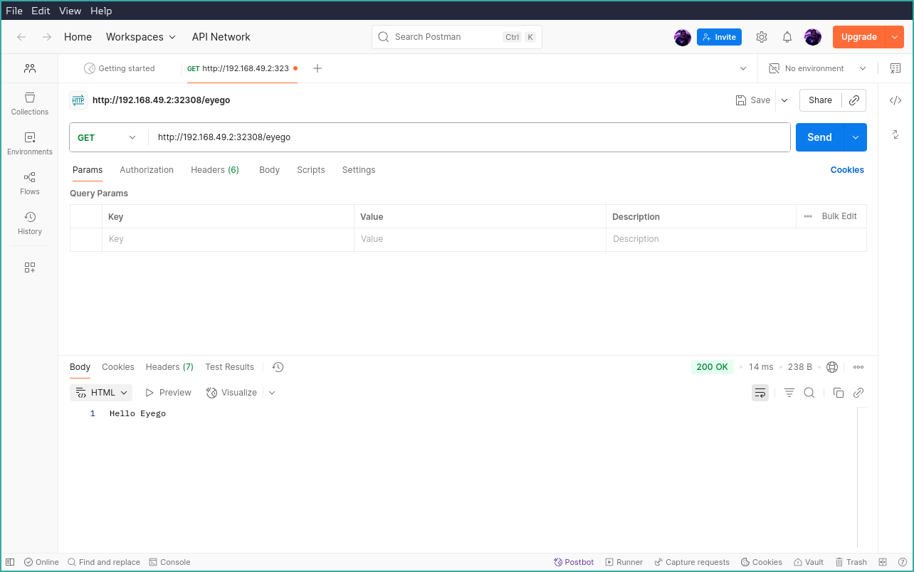
  - 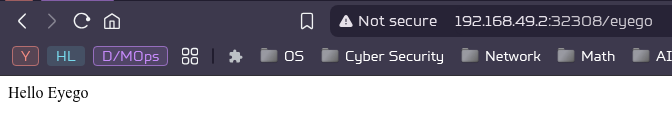

---

### Deploy to EKS

- I'll use `eksctl` to create a cluster, now create a new cluster

```bash
cd k8s
eksctl create cluster -f cluster.yaml
```

It will take some time as it uses CloudFormation to create and manage the cluster, EC2, VPC, and all needed resources

- update `kubectl` to connect to `EKS` cluster

```bash
aws eks --region us-east-1 update-kubeconfig --name eyego-cls
```
- deploy

```bash
kubectl apply -f deployment.yaml -f service.yaml
```
- see pods `kubectl get pods`

```bash
NAME                         READY   STATUS    RESTARTS   AGE
eyego-app-67c5cb48dd-nrgfg   0/1     Pending   0          23s
eyego-app-67c5cb48dd-s6phv   0/1     Pending   0          23s
```

Why get stuck? After troubleshooting, I found the `t3.micro` reached the maximum No. pods

run this command `kubectl describe pod eyego-app-67c5cb48dd-nrgfg`
or grep the `Events`, use `kubectl describe pod eyego-app-67c5cb48dd-nrgfg | grep Events`

```bash
Events:
  Type     Reason            Age   From               Message
  ----     ------            ----  ----               -------
  Warning  FailedScheduling  67s   default-scheduler  0/2 nodes are available: 2 Too many pods. preemption: 0/2 nodes are available: 2 No preemption victims found for incoming pod.
```

Why get the maximum No. pods? because there are running pods::
- metrics-server (2 pods)
- coredns (2 pods)
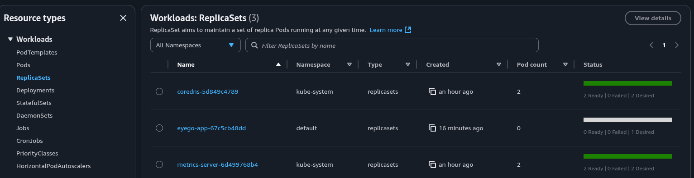

So, we should scale up EC2 instances, we can use `t3.small`, and update the cluster

```bash
eksctl delete nodegroup --cluster eyego-task-cluster --name eyego-ng
eksctl create nodegroup --config-file cluster.yaml
```

If you get errors, delete the cluster and create it again

```bash
eksctl delete cluster -f cluster.yaml
eksctl create cluster -f cluster.yaml
```

if you get this error
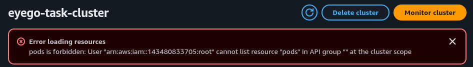

- Create an access entry for your IAM and give the necessary permissions
- create entry
  - `aws eks create-access-entry --cluster-name your-cluster-name --principal-arn <your-iam-arn> --region your-region`

  - `aws eks create-access-entry --cluster-name eyego-task-cluster --principal-arn arn:aws:iam::143480833705:root --region us-east-1`

- gives permissions
  - `aws eks associate-access-policy --cluster-name your-cluster-name --principal-arn <your-iam-arn> --policy-arn <policy-arn> --access-scope type=cluster --region your-region`

```
aws eks associate-access-policy --cluster-name eyego-task-cluster --principal-arn arn:aws:iam::143480833705:root --policy-arn arn:aws:eks::aws:cluster-access-policy/AmazonEKSViewPolicy --access-scope type=cluster --region us-east-1

aws eks associate-access-policy --cluster-name eyego-task-cluster --principal-arn arn:aws:iam::143480833705:root --policy-arn arn:aws:eks::aws:cluster-access-policy/AmazonEKSEditPolicy --access-scope type=cluster --region us-east-1

aws eks associate-access-policy --cluster-name eyego-task-cluster --principal-arn arn:aws:iam::143480833705:root --policy-arn arn:aws:eks::aws:cluster-access-policy/AmazonEKSClusterAdminPolicy --access-scope type=cluster --region us-east-1
```

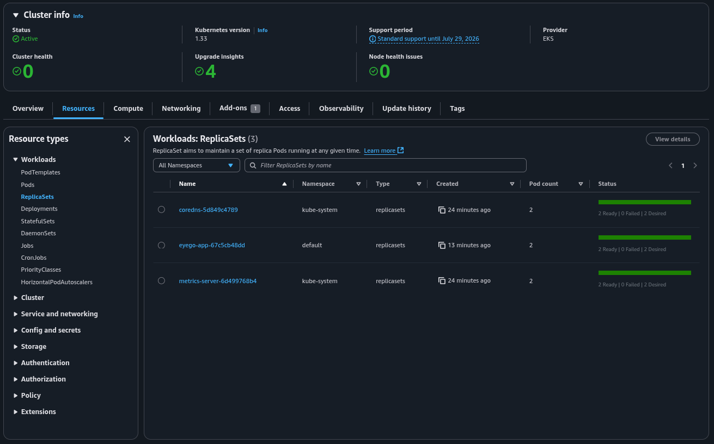

get the service `kubectl get service eyego-service`, you can access with `EXTERNAL-IP`
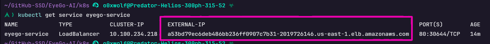

- visit [a53bd79ec6deb486bb236ff0907c7b31-2019726146.us-east-1.elb.amazonaws.com/eyego](a53bd79ec6deb486bb236ff0907c7b31-2019726146.us-east-1.elb.amazonaws.com/eyego) from browser

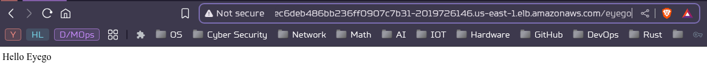

- test with postman

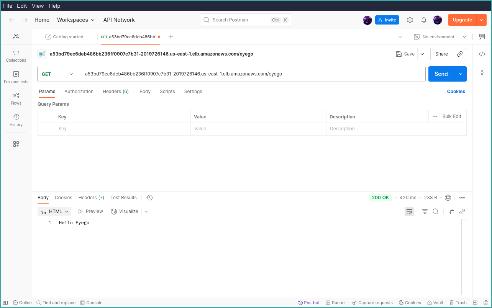

---

### Deploy to EKS Using GitHub Actions


---

### For the complex solution, we can use Terraform and Kops

---

### Resources:
- [How to create a REST API with Node.js and Express](https://blog.postman.com/how-to-create-a-rest-api-with-node-js-and-express)
- [Configure credentials for AWS Elastic Container Registry using registry-creds addon](https://minikube.sigs.k8s.io/docs/tutorials/configuring_creds_for_aws_ecr)
- [Amazon EKS – eksctl](https://docs.aws.amazon.com/eks/latest/userguide/getting-started-eksctl.html)
- how to use `eksctl` with config file: [Creating and managing clusters](https://docs.aws.amazon.com/eks/latest/eksctl/creating-and-managing-clusters.html)
- [Deploy an application to Amazon EKS](https://docs.aws.amazon.com/codecatalyst/latest/userguide/deploy-tut-eks.html)
- [Deploying a Simple Application Using EKS: Step-by-Step Guide](https://medium.com/@tamerbenhassan/deploying-a-simple-application-using-eks-step-by-step-guide-512b1559a7bd)
- How to create a [VPC](https://docs.aws.amazon.com/eks/latest/userguide/creating-a-vpc.html#create-vpc)